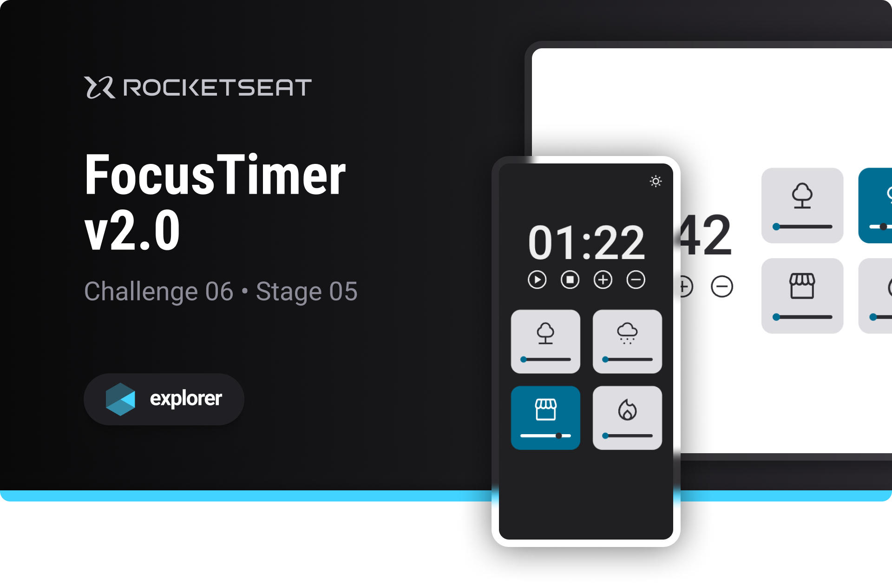

# FocusTimer v2.0

Challenge developed on Rocketseat's Explorer course

**FocusTimer v2.0 is a pomodoro style timer designed to put into practice JavaScript programming concepts**

## 🔗 Project Links

- 🚀 [**Deploy**](https://emanueltavecia.github.io/focustimer-v2.0)
- 🎨 [**Figma**](https://www.figma.com/file/Pw8yMsK7HFkD6aISZt6gPA/Stage-05---Focus-Timer-2.0/duplicate)

## 📋 Project information

- Rocketseat Explorer
- Stage 05
- Challenge 06

## Instructions for use

- You can increase or decrease the time by 5 minutes with the plus and minus buttons.
- You can activate one of the 4 background sound options and choose the volume with the slider.

## 🧠 Concepts learned

The development of this challenge aims to put the following concepts into practice:

- Light and dark mode
- CSS :not
- ES6 Modules
- DOM Manipulation
- functions

## 💻 Technologies

## 📄 License

This project is licensed under the MIT License - see the [LICENSE](./LICENSE) file for more details.
